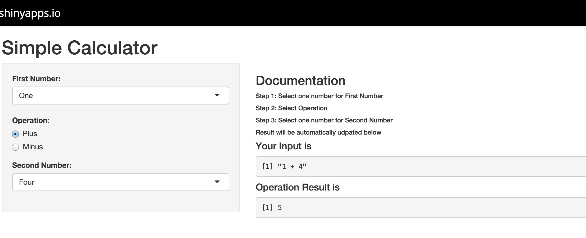

## Page 2: My App

I do have a great idea to predicate some age-income data in my area, but I didn't have time to build the model and etc, so my App for course project is a simple calculator.

---

## Page 3: To Use the App

1. Go To https://haidonggu.shinyapps.io/Project/
2. Select one number for First Number
3. Select Operation
4. Select one number for Second Number
5. Result will be automatically udpated below

--- .class #id 

## Page 4: Screenshot

<div style='text-align: center;'>
    
</div>

--- 

## Page: Some embedded R code

The R code is straight forward, for example, if you pick "2"" as first number, "Plus" as operator and "4" as second number, we will have

```r
2 + 4
```

```
## [1] 6
```

